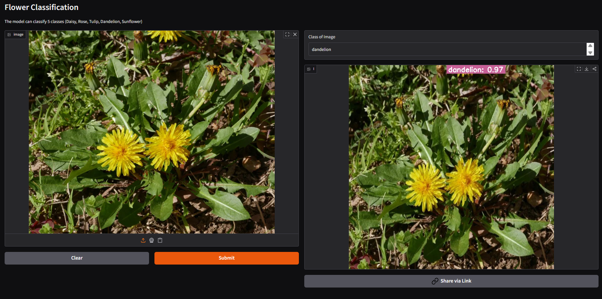

# Flower Classification (ResNet50 + Gradio)

A simple flower image classifier for 5 classes (Daisy, Rose, Tulip, Dandelion, Sunflower) built with PyTorch and served with a Gradio UI.

## Live demo

Try it on Hugging Face Spaces: https://huggingface.co/spaces/offline29940/classiFlower

### Preview



- Inference pipeline: [`predictor.infer.Prediction`](predictor/infer.py)
- Model definition: [`predictor.classifier.ResNet50Classifier`](predictor/classifier.py)
- Gradio app entry point: [app.py](app.py)
- Pretrained checkpoint: [models/resnet50flower-e100.pth](models/resnet50flower-e100.pth)

## Project structure

```
.
├── app.py
├── models/
│   └── resnet50flower-e100.pth
├── predictor/
│   ├── __init__.py
│   ├── classifier.py
│   └── infer.py
├── requirements.txt
└── LICENSE
```

## How it works

- A ResNet-50 backbone is loaded and its final layer is replaced to match the number of flower classes in the checkpoint ([`predictor.classifier.ResNet50Classifier`](predictor/classifier.py)).
- During inference, images are preprocessed with torchvision transforms (resize, center-crop, normalize), then passed through the model to get softmax probabilities and top-5 predictions ([`predictor.infer.Prediction`](predictor/infer.py)).
- The top-1 label and confidence are drawn onto the input image and saved as `predicted_image.jpg`.

Note: [`predictor.infer.Prediction.inference`](predictor/infer.py) returns a tuple `(label, output_image_path)`.

## Dataset

- Personalized dataset hosted on Roboflow Universe: https://universe.roboflow.com/intellgicare/flower-classifications-whcnu
  - Train split: 4096 images
- Source images collected from Kaggle (Flowers Recognition): https://www.kaggle.com/datasets/alxmamaev/flowers-recognition

## Setup

1. Create a virtual environment (recommended) and install dependencies:
   ```sh
   pip install -r requirements.txt
   ```
2. Ensure the model checkpoint exists at:
   ```
   ./models/resnet50flower-e100.pth
   ```

## Run the app

Launch the Gradio UI:

```sh
python app.py
```

Gradio will print a local URL. Open it in your browser, upload an image, and see:

- Class of Image (top-1 label)
- Annotated image preview

## Programmatic usage

Use the inference API directly:

```python
from predictor.infer import Prediction

model_path = "./models/resnet50flower-e100.pth"
predictor = Prediction(model_path=model_path)

label, output_image_path = predictor.inference("path/to/your/image.jpg")
print(label)                # e.g., "Daisy: 0.98"
print(output_image_path)    # "predicted_image.jpg"
```

## Configuration notes

- Device: Inference is set to CPU by default. To enable GPU, change the device initialization in [`predictor.infer.Prediction.__init__`](predictor/infer.py).
- Output: Annotated images are saved as `predicted_image.jpg` in the project root.

## License

This project is licensed under the MIT License. See [LICENSE](LICENSE) for details.
